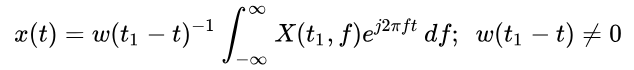

# Istft

## 产品支持情况

|产品             |  是否支持  |
|:-------------------------|:----------:|
|  <term>Atlas 200I/500 A2 推理产品</term>    |     ×    |
|  <term>Atlas 推理系列产品</term>    |     ×    |
|  <term>Atlas 训练系列产品</term>    |     ×    |
|  <term>Atlas A3 训练系列产品/Atlas A3 推理系列产品</term>   |     √    |
|  <term>Atlas A2 训练系列产品/Atlas A2 推理系列产品</term>     |     √    |
|  <term>Ascend 950PR/Ascend 950DT</term>   |     ×  |


## 功能说明

- 接口功能：\
asdFftIstftMakePlan：初始化该句柄对应的istft配置。\
asdFftExecIstft：执行逆短时傅里叶变换。
- 计算公式：\
istft函数用于进行逆短时傅里叶变换，它的目标是将stft得到的频域数据转换回时域信号，是stft的逆运算。短时距傅里叶变换是可逆的，也就是说原本的信号可以借由反短时距傅里叶变换将短时距傅里叶变换后的信号还原。其中最广为接受的反短时距傅里叶变换方法是重叠-相加之卷积法。

  

  其中，傅里叶变换（Fourier transform）是一种线性积分变换，用于信号在时域和频域之间的变换，在物理学和工程学中有许多应用。对应给定长度为N的信号，DFT表达式如下：

  

  将系数矩阵(N*N)和时域信号(N*1)看作两个Tensor，在NPU上直接使用矩阵乘，可完成DFT。但时间复杂度太高，因此需要快速傅里叶变换。其基本原理是利用三角函数在复数域的旋转对称性，将序列拆分成子序列，通过蝶形运算以降低计算的复杂度：

  

  而重叠-相加之卷积法( Overlap-add method ) 是一种区块卷积 ( block convolution, sectioned convolution )，可以有效的计算一个很长的信号 x[n]和一个FIR滤波器h[n]的离散卷积。其中h[m]在 [1, M]之外为零。

  

 
## 函数原型

```Cpp
AspbStatus asdFftIstftMakePlan(
  asdFftHandle              handle, 
  const aclTensor *         input, 
  const int64_t             nFft,
  const int64_t             hopLengthOpt, 
  const int64_t             winLengthOpt,
  const bool                center, 
  const bool                normalized, 
  const bool                onesidedOpt,
  const int64_t             lengthOpt, 
  const bool                returnComplex)
```
```Cpp
AspbStatus asdFftExecIstft(
  asdFftHandle              handle, 
  const aclTensor *         input, 
  const aclTensor *         windowOpt, 
  const aclTensor *         output)
```

## asdFftIstftMakePlan

- **参数说明：**

  <table style="undefined;table-layout: fixed; width: 880px"><colgroup>
    <col style="width: 250px">
    <col style="width: 120px">
    <col style="width: 510px">
  </colgroup>
  <thead>
      <tr>
        <th>参数名</th>
        <th>输入/输出</th>
        <th>描述</th>
      </tr></thead>
  <tbody>
    <tr>
      <td>handle（asdFftHandle）</td>
      <td>输入</td>
      <td>算子的句柄，需要手动申请创建asdFftHandle对象。</td>
    </tr>
    <tr>
      <td>input（aclTensor *）</td>
      <td>输入</td>
      <td><ul><li>对应公式中的'x'。</li><li>数据格式支持ND，格式预期与stft输出相同。</li><li>数据类型仅支持COMPLEX64。</li><li>shape为(B, N, T)<ul><li>'B'是批处理维度。</li><li>N是频率样本的数量，当onesidedOpt为true时， 为 (nFft // 2) + 1，当onesidedOpt为false时，为nFft。</li><li>T是帧的数量，对于中心填充的STFT，取值为“1 + lengthOpt // hopLengthOpt”，其他场景取值为 “1 + (lengthOpt - nFft) // hopLengthOpt”。</li></ul></li></ul></td>
    </tr>
    <tr>
      <td>nFft（int64_t）</td>
      <td>输入</td>
      <td>傅里叶变换的大小。</td>
    </tr>
    <tr>
      <td>hopLengthOpt（int64_t）</td>
      <td>输入</td>
      <td>相邻滑动窗口帧之间的距离，0 < hopLengthOpt <= nFft。</td>
    </tr>
    <tr>
      <td>winLengthOpt（int64_t）</td>
      <td>输入</td>
      <td>窗口帧长度，winLengthOpt = nFft。</td>
    </tr>
    <tr>
      <td>center（bool）</td>
      <td>输入</td>
      <td>表示是否对input的两侧进行了填充，默认等于true，当前版本只支持true。</td>
    </tr>
    <tr>
      <td>normalized（bool）</td>
      <td>输入</td>
      <td>表示STFT是否已标准化，默认等于false，当前版本只支持false。</td>
    </tr>
    <tr>
      <td>onesidedOpt（bool）</td>
      <td>输入</td>
      <td>表示STFT是否为onesided，默认等于false，当前版本只支持false。</td>
    </tr>
    <tr>
      <td>lengthOpt（int64_t）</td>
      <td>输入</td>
      <td>信号将被修剪的量（即原始信号长度），当前版本不支持该参数，默认为0。</td>
    </tr>
    <tr>
      <td>returnComplex（bool）</td>
      <td>输入</td>
      <td>输出是否应为复数，默认为True，当前版本只支持True。</td>
    </tr>
    </table>
- **返回值**：

  返回状态码，具体参见[SiP返回码](../context/SiP返回码.md)。
  
## asdFftExecIstft

- **参数说明：**

  <table style="undefined;table-layout: fixed; width: 880px"><colgroup>
    <col style="width: 250px">
    <col style="width: 120px">
    <col style="width: 510px">
  </colgroup>
  <thead>
      <tr>
        <th>参数名</th>
        <th>输入/输出</th>
        <th>描述</th>
      </tr></thead>
  <tbody>
    <tr>
      <td>handle（asdFftHandle）</td>
      <td>输入</td>
      <td>算子的句柄，需要手动申请创建asdFftHandle对象。</td>
    </tr>
    <tr>
      <td>input（aclTensor *）</td>
      <td>输入</td>
      <td><ul><li>对应公式中的'x'。</li><li>数据格式支持ND，格式预期与stft输出相同。</li><li>数据类型仅支持COMPELX64。</li><li>shape为(B, N, T)<ul><li>'B'是批处理维度。</li><li>N 是频率样本的数量，对于 onesided为true， 输入为 (n_fft // 2) + 1，否则为 n_fft。</li><li>T是帧的数量，对于中心填充的stft为 1 + length // hop_length，否则为 1 + (length - n_fft) // hop_length。</li></ul></li></ul></td>
    </tr>
    <tr>
      <td>windowOpt（aclTensor *）</td>
      <td>输入</td>
      <td><ul><li>对应公式中的'w'。</li><li>数据格式支持ND。</li><li>数据类型仅支持FLOAT。</li><li>shape为[win_length]。<ul></td>
    </tr>
    <tr>
      <td>output（aclTensor *）</td>
      <td>输出</td>
      <td><ul><li>数据格式支持ND。</li><li>数据类型仅支持COMPLEX64。</li><li>shape为（B, length）。<ul></td>
    </tr>
    </table>
- **返回值**：

  返回状态码，具体参见[SiP返回码](../context/SiP返回码.md)。

## 约束说明

- istft均不支持本地更新，即不允许输入tensor和输出tensor是同一个tensor。

- 为了使istft能够正确地重构信号，n_fft、hop_length、win_length、window、center和normalized这些参数必须与之前进行stft变换时使用的参数保持一致。

- 输入的元素不支持inf、-inf和nan，如果输入中包含这些值, 那么结果为未定义。

- asdFftIstftMakePlan
    - nFft需保证不超过1500且分解质因数后不包含超过199的质因子。
    - 当前功能实现所限，nFft大于等于32768且为2的幂的时候，会修改输入数据，需提前做好备份。
    - hopLengthOpt <= 1500。
    - 输入的元素不支持inf、-inf和nan，如果输入中包含这些值, 那么结果为未定义。
- asdFftExecIstft\
  windowOpt tensor数值不能有接近零的最小值，否则结果未定义。

## 调用示例

示例代码如下，该样例旨在提供快速上手、开发和调试算子的最小化实现，其核心目标是使用最精简的代码展示算子的核心功能，而非提供生产级的安全保障。不推荐用户直接将示例代码作为业务代码，若用户将示例代码应用在自身的真实业务场景中且发生了安全问题，则需用户自行承担。
```Cpp
#include <iostream>
#include <vector>
#include "asdsip.h"
#include "acl/acl.h"
#include "aclnn/acl_meta.h"
using namespace AsdSip;

#define CHECK_RET(cond, return_expr) \
    do {                             \
        if (!(cond)) {               \
            return_expr;             \
        }                            \
    } while (0)

#define LOG_PRINT(message, ...)         \
    do {                                \
        printf(message, ##__VA_ARGS__); \
    } while (0)

#define ASD_STATUS_CHECK(err)                                                \
    do {                                                                     \
        AsdSip::AspbStatus err_ = (err);                                     \
        if (err_ != AsdSip::ErrorType::ACL_SUCCESS) {                                      \
            std::cout << "Execute failed." << std::endl; \
            exit(-1);                                                        \
        }                                                                    \
    } while (0)

int64_t GetShapeSize(const std::vector<int64_t> &shape)
{
    int64_t shapeSize = 1;
    for (auto i : shape) {
        shapeSize *= i;
    }
    return shapeSize;
}

int Init(int32_t deviceId, aclrtStream *stream)
{
    // 固定写法，AscendCL初始化
    auto ret = aclInit(nullptr);
    CHECK_RET(ret == ::ACL_SUCCESS, LOG_PRINT("aclInit failed. ERROR: %d\n", ret); return ret);
    ret = aclrtSetDevice(deviceId);
    CHECK_RET(ret == ::ACL_SUCCESS, LOG_PRINT("aclrtSetDevice failed. ERROR: %d\n", ret); return ret);
    ret = aclrtCreateStream(stream);
    CHECK_RET(ret == ::ACL_SUCCESS, LOG_PRINT("aclrtCreateStream failed. ERROR: %d\n", ret); return ret);
    return 0;
}

template <typename T>
int CreateAclTensor(const std::vector<T> &hostData, const std::vector<int64_t> &shape, void **deviceAddr,
    aclDataType dataType, aclTensor **tensor)
{
    auto size = GetShapeSize(shape) * sizeof(T);
    // 调用aclrtMalloc申请device侧内存
    auto ret = aclrtMalloc(deviceAddr, size, ACL_MEM_MALLOC_HUGE_FIRST);
    CHECK_RET(ret == ::ACL_SUCCESS, LOG_PRINT("aclrtMalloc failed. ERROR: %d\n", ret); return ret);
    // 调用aclrtMemcpy将host侧数据复制到device侧内存上
    ret = aclrtMemcpy(*deviceAddr, size, hostData.data(), size, ACL_MEMCPY_HOST_TO_DEVICE);
    CHECK_RET(ret == ::ACL_SUCCESS, LOG_PRINT("aclrtMemcpy failed. ERROR: %d\n", ret); return ret);

    // 计算连续tensor的strides
    std::vector<int64_t> strides(shape.size(), 1);
    for (int64_t i = shape.size() - 2; i >= 0; i--) {
        strides[i] = shape[i + 1] * strides[i + 1];
    }

    // 调用aclCreateTensor接口创建aclTensor
    *tensor = aclCreateTensor(shape.data(),
        shape.size(),
        dataType,
        strides.data(),
        0,
        aclFormat::ACL_FORMAT_ND,
        shape.data(),
        shape.size(),
        *deviceAddr);
    return 0;
}

int main()
{
    int32_t deviceId = 0;
    aclrtStream stream;
    auto ret = Init(deviceId, &stream);
    CHECK_RET(ret == ::ACL_SUCCESS, LOG_PRINT("Init acl failed. ERROR: %d\n", ret); return ret);

    // 创造tensor的Host侧数据
    int64_t channel = 10, nFrames = 20, nFft = 16, hopLen = 4, winLen = 16;
    int64_t outLen = nFft + hopLen * (nFrames - 1) - nFft / 2 - nFft / 2;
    bool returnComplex = true;
    bool center = true, normalized = false, onesidedOpt = false;
    const int64_t tensorInSize = channel * nFrames * nFft;
    const int64_t tensorWinSize = winLen;
    const int64_t tensorOutSize = channel * outLen;
    std::vector<int64_t> selfShape = {channel, nFft, nFrames};
    std::vector<int64_t> winShape = {winLen};
    std::vector<int64_t> outShape = {channel, outLen};

    std::vector<std::complex<float>> inputHostData(tensorInSize, std::complex<float>(0, 0));
    for (int i = 0; i < tensorInSize; i++) {
        inputHostData[i] = std::complex<float>(i *  200.0f / tensorInSize - 100, i *  100.0f / tensorInSize - 50);
    }
    std::vector<float> winHostData(tensorWinSize, 0.0f);
    for (int i = 0; i < tensorWinSize; i++) {
        winHostData[i] = 1.0f / winLen * i ;
    }
    std::vector<std::complex<float>> outHostData(tensorOutSize, std::complex<float>(0, 0));

    void *inputDeviceAddr = nullptr;
    void *winDeviceAddr = nullptr;
    void *outDeviceAddr = nullptr;
    aclTensor *input = nullptr;
    aclTensor *win = nullptr;
    aclTensor *out = nullptr;
    ret = CreateAclTensor(inputHostData, selfShape, &inputDeviceAddr, aclDataType::ACL_COMPLEX64, &input);
    CHECK_RET(ret == ::ACL_SUCCESS, return ret);
    ret = CreateAclTensor(winHostData, winShape, &winDeviceAddr, aclDataType::ACL_FLOAT, &win);
    CHECK_RET(ret == ::ACL_SUCCESS, return ret);
    ret = CreateAclTensor(outHostData, outShape, &outDeviceAddr, aclDataType::ACL_COMPLEX64, &out);
    CHECK_RET(ret == ::ACL_SUCCESS, return ret);

    asdFftHandle handle;
    asdFftCreate(handle);
    asdFftIstftMakePlan(handle, input, nFft, hopLen, winLen, center, normalized, onesidedOpt, 0, returnComplex);

    size_t work_size;
    asdFftGetWorkspaceSize(handle, work_size);
    void *workspaceAddr = nullptr;
    if (work_size > 0) {
        ret = aclrtMalloc(&workspaceAddr, static_cast<int64_t>(work_size), ACL_MEM_MALLOC_HUGE_FIRST);
        CHECK_RET(ret == ::ACL_SUCCESS, LOG_PRINT("allocate workspace failed. ERROR: %d\n", ret); return ret);
    }
    asdFftSetWorkspace(handle, (uint8_t *)workspaceAddr);

    asdFftSetStream(handle, stream);
    ASD_STATUS_CHECK(asdFftExecIstft(handle, input, win, out));

    ret = aclrtSynchronizeStream(stream);
    CHECK_RET(ret == ::ACL_SUCCESS, LOG_PRINT("aclrtSynchronizeStream failed. ERROR: %d\n", ret); return ret);

    asdFftDestroy(handle);

    auto size = GetShapeSize(outShape);
    std::vector<std::complex<float>> outData(size, 0);
    ret = aclrtMemcpy(outData.data(),
        outData.size() * sizeof(outData[0]),
        outDeviceAddr,
        size * sizeof(outData[0]),
        ACL_MEMCPY_DEVICE_TO_HOST);

    // 打印输出tensor值中前16个
    for (int64_t i = 0; i < 16; i++) {
        std::cout << static_cast<std::complex<float>>(outData[i]) << "\t";
    }
    std::cout << "\nend result" << std::endl;
    std::cout << "Execute successfully." << std::endl;

    aclDestroyTensor(input);
    aclDestroyTensor(win);
    aclDestroyTensor(out);
    aclrtFree(inputDeviceAddr);
    aclrtFree(winDeviceAddr);
    aclrtFree(outDeviceAddr);
    if (work_size > 0) {
        aclrtFree(workspaceAddr);
    }
    aclrtDestroyStream(stream);
    aclrtResetDevice(deviceId);
    aclFinalize();
    return 0;
}
```

