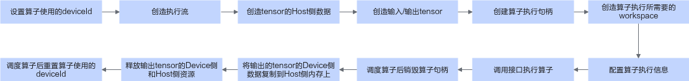

# 算子使用指导

在安装部署完信号处理加速库软件包后，用户可以调用软件包提供的算子API实现高性能、高精度的信号处理应用，本节介绍基本算子调用样例。

## 安全声明

若用户在真实业务场景中不按照规范流程顺序调用算子且发生了安全问题，需用户自行承担。

## 算子调用流程



## 操作步骤

- 新建样例文件，命名为example.cpp，如下所示。

```Cpp
#include <iostream>
#include <vector>
#include "asdsip.h"
#include "acl/acl.h"
#include "acl_meta.h"

using namespace AsdSip;

#define ASD_STATUS_CHECK(err)                                                \
    do {                                                                     \
        AsdSip::AspbStatus err_ = (err);                                     \
        if (err_ != AsdSip::ErrorType::ACL_SUCCESS) {                                      \
            std::cout << "Execute failed." << std::endl; \
            exit(-1);                                                        \
        }                                                                    \
    } while (0)

#define CHECK_RET(cond, return_expr) \
    do {                             \
        if (!(cond)) {               \
            return_expr;             \
        }                            \
    } while (0)

#define LOG_PRINT(message, ...)         \
    do {                                \
        printf(message, ##__VA_ARGS__); \
    } while (0)

int64_t GetShapeSize(const std::vector<int64_t> &shape)
{
    int64_t shapeSize = 1;
    for (auto i : shape) {
        shapeSize *= i;
    }
    return shapeSize;
}

int Init(int32_t deviceId, aclrtStream *stream)
{
    // 固定写法，acl初始化
    auto ret = aclInit(nullptr);
    CHECK_RET(ret == ::ACL_SUCCESS, LOG_PRINT("aclInit failed. ERROR: %d\n", ret); return ret);
    ret = aclrtSetDevice(deviceId);
    CHECK_RET(ret == ::ACL_SUCCESS, LOG_PRINT("aclrtSetDevice failed. ERROR: %d\n", ret); return ret);
    ret = aclrtCreateStream(stream);
    CHECK_RET(ret == ::ACL_SUCCESS, LOG_PRINT("aclrtCreateStream failed. ERROR: %d\n", ret); return ret);
    return 0;
}

template <typename T>
int CreateAclTensor(const std::vector<T> &hostData, const std::vector<int64_t> &shape, void **deviceAddr,
    aclDataType dataType, aclTensor **tensor)
{
    auto size = GetShapeSize(shape) * sizeof(T);
    // 调用aclrtMalloc申请device侧内存
    auto ret = aclrtMalloc(deviceAddr, size, ACL_MEM_MALLOC_HUGE_FIRST);
    CHECK_RET(ret == ::ACL_SUCCESS, LOG_PRINT("aclrtMalloc failed. ERROR: %d\n", ret); return ret);
    // 调用aclrtMemcpy将host侧数据复制到device侧内存上
    ret = aclrtMemcpy(*deviceAddr, size, hostData.data(), size, ACL_MEMCPY_HOST_TO_DEVICE);
    CHECK_RET(ret == ::ACL_SUCCESS, LOG_PRINT("aclrtMemcpy failed. ERROR: %d\n", ret); return ret);

    // 计算连续tensor的strides
    std::vector<int64_t> strides(shape.size(), 1);
    for (int64_t i = shape.size() - 2; i >= 0; i--) {
        strides[i] = shape[i + 1] * strides[i + 1];
    }

    // 调用aclCreateTensor接口创建aclTensor
    *tensor = aclCreateTensor(shape.data(),
        shape.size(),
        dataType,
        strides.data(),
        0,
        aclFormat::ACL_FORMAT_ND,
        shape.data(),
        shape.size(),
        *deviceAddr);
    return 0;
}

int main(int argc, char **argv)
{
    // 设置算子使用的device id
    int deviceId = 0;
    //（固定写法）创建执行流
    aclrtStream stream;
    auto ret = Init(deviceId, &stream);
    CHECK_RET(ret == ::ACL_SUCCESS, LOG_PRINT("Init acl failed. ERROR: %d\n", ret); return ret);

    // 创造tensor的Host侧数据
    int64_t n = 5;
    int64_t incx = 1;
    int64_t incy = 1;

    int64_t xSize = 5;
    std::vector<float> tensorInXData;
    tensorInXData.reserve(xSize);
    for (int64_t i = 0; i < xSize; i++) {
        tensorInXData[i] = 1.0 + i;
    }

    int64_t ySize = 5;
    std::vector<float> tensorInYData;
    tensorInYData.reserve(xSize);
    for (int64_t i = 0; i < ySize; i++) {
        tensorInYData[i] = 10.0 + i;
    }

    int64_t resultSize = 1;
    std::vector<float> resultData;
    resultData.reserve(resultSize);

    std::cout << "------- input x -------" << std::endl;
    for (int64_t i = 0; i < xSize; i++) {
        std::cout << tensorInXData[i] << " ";
    }
    std::cout << std::endl;

    std::cout << "------- input y -------" << std::endl;
    for (int64_t i = 0; i < ySize; i++) {
        std::cout << tensorInYData[i] << " ";
    }
    std::cout << std::endl;

    // 创造输入/输出tensor
    std::vector<int64_t> xShape = {xSize};
    std::vector<int64_t> yShape = {ySize};
    std::vector<int64_t> resultShape = {resultSize};
    aclTensor *inputX = nullptr;
    aclTensor *inputY = nullptr;
    aclTensor *result = nullptr;
    void *inputXDeviceAddr = nullptr;
    void *inputYDeviceAddr = nullptr;
    void *resultDeviceAddr = nullptr;
    ret = CreateAclTensor(tensorInXData, xShape, &inputXDeviceAddr, aclDataType::ACL_FLOAT, &inputX);
    CHECK_RET(ret == ::ACL_SUCCESS, return ret);
    ret = CreateAclTensor(tensorInYData, yShape, &inputYDeviceAddr, aclDataType::ACL_FLOAT, &inputY);
    CHECK_RET(ret == ::ACL_SUCCESS, return ret);
    ret = CreateAclTensor(resultData, resultShape, &resultDeviceAddr, aclDataType::ACL_FLOAT, &result);
    CHECK_RET(ret == ::ACL_SUCCESS, return ret);

    // 创建算子执行句柄
    asdBlasHandle handle;
    asdBlasCreate(handle);

    // 创造算子执行所需workspace
    size_t lwork = 0;
    void *buffer = nullptr;
    asdBlasMakeDotPlan(handle);
    asdBlasGetWorkspaceSize(handle, lwork);
    std::cout << "lwork = " << lwork << std::endl;
    if (lwork > 0) {
        ret = aclrtMalloc(&buffer, static_cast<int64_t>(lwork), ACL_MEM_MALLOC_HUGE_FIRST);
        CHECK_RET(ret == ::ACL_SUCCESS, LOG_PRINT("allocate workspace failed. ERROR: %d\n", ret); return ret);
    }
    asdBlasSetWorkspace(handle, buffer);

    // 配置算子执行信息
    asdBlasSetStream(handle, stream);

    // 调用接口执行算子（固定调用逻辑）
    ASD_STATUS_CHECK(asdBlasSdot(handle, n, inputX, incx, inputY, incy, result));
    asdBlasSynchronize(handle);

    // 调度算子后销毁算子句柄
    asdBlasDestroy(handle);

    // 将输出tensor的Device侧数据复制到Host侧内存上
    ret = aclrtMemcpy(resultData.data(),
        resultSize * sizeof(float),
        resultDeviceAddr,
        resultSize * sizeof(float),
        ACL_MEMCPY_DEVICE_TO_HOST);
    CHECK_RET(ret == ::ACL_SUCCESS, LOG_PRINT("copy result from device to host failed. ERROR: %d\n", ret); return ret);

    std::cout << "------- result -------" << std::endl;
    for (int64_t i = 0; i < 1; i++) {
        std::cout << resultData[i] << " ";
    }
    std::cout << std::endl;
    std::cout << "Execute successfully." << std::endl;

    // 资源释放
    aclDestroyTensor(inputX);
    aclDestroyTensor(inputY);
    aclDestroyTensor(result);
    aclrtFree(inputXDeviceAddr);
    aclrtFree(inputYDeviceAddr);
    aclrtFree(resultDeviceAddr);
    aclrtDestroyStream(stream);
    aclrtResetDevice(deviceId);
    aclFinalize();
    return 0;
}
```

- 执行如下命令，编译示例代码。

```Cpp
g++  example.cpp \
    -I${ASCEND_HOME_PATH}/include/aclnn \
    -I${ASCEND_HOME_PATH}/include \
    -L${ASCEND_HOME_PATH}/lib64/ -lascendcl -lopapi -lnnopbase \
    -I${ASDSIP_HOME_PATH}/include \
    -L${ASDSIP_HOME_PATH}/lib -lmki \
    -L${ASDSIP_HOME_PATH}/lib -lasdsip \
    -L${ASDSIP_HOME_PATH}/lib -lasdsip_core \
    -L${ASDSIP_HOME_PATH}/lib -lasdsip_host \
    -o example
```

- 执行example：

```Cpp
{PATH_TO_EXAMPLE}/example
```

- 输出结果如下，表示x和y点积为190：

```Cpp

------- input x -------
1 2 3 4 5
------- input y -------
10 11 12 13 14

------- result -------
190

```
