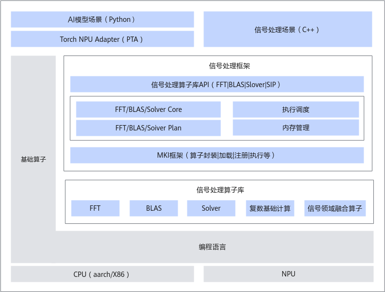

# 简介

昇腾信号处理加速库（AscendSiPBoost）面向AI模型场景（支持PyTorch调用）、信号处理场景（支持C++直接调用），提供一系列信号处理领域相关的高性能算子，包括BLAS（Basic Linear Algebra Subprograms，基本线性代数子系统库）、FFT（Fast Fourier Transform，快速傅里叶变换）、复数基础计算以及信号领域融合算子。

本文档主要用于指导信号处理加速库的安装部署，并结合典型的使用场景给出样例代码，指导开发人员快速掌握使用方法。

## 架构图

昇腾信号处理加速库（AscendSiPBoost）在昇腾算子技术栈中的位置下图所示。
 

- 信号处理加速库框架：负责算子的管理，算子在Device侧的二进制加载及host侧的tiling；负责对上层提供接口支持单算子调用、多算子批量调用等。
- FFT算子：包括专用的NPU Kernel、PLAN框架，对外提供接口以实现C2C、C2R和R2C，供开发者使用。
- BLAS算子：依照BLAS相关的标准定义，提供专用的Kernel，对外提供从level1到level3的接口，供开发者使用。
- 复数基础计算库：提供基础的支持复数类型的算子，支持用户侧组合使用。本期暂不提供。
- 信号领域融合算子库：包含PC、MTD、CFAR、Interpolation等融合算子，支撑脉冲信号分析，动态目标检测，恒虚警等场景。本期提供部分插值算子。
- Solver算子：主要提供基于BLAS的复杂线性代数函数，例如矩阵分解、特征值求解等。本期不提供。

## 架构图

  <term>Atlas A2 训练系列产品/Atlas A2 推理系列产品</term>\
  <term>Atlas A3 训练系列产品/Atlas A3 推理系列产品</term>\
  <term>Ascend 950PR/Ascend 950DT</term> 
